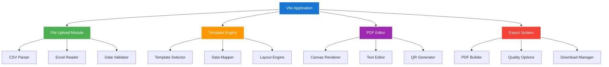
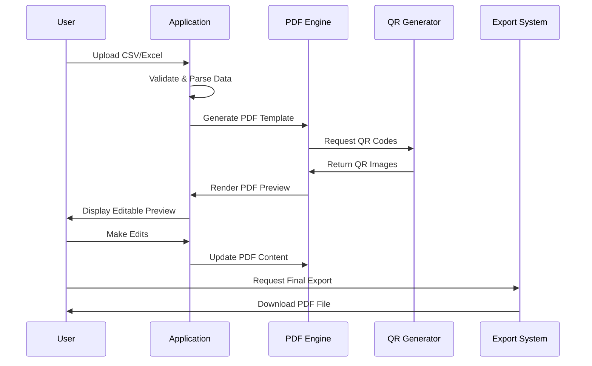

# OTMT Brochure Automation Tool

<div align="center">
  <h3>📄 Professional PDF Brochure Generator</h3>
  <p><em>Transform technology data into stunning marketing materials with real-time editing</em></p>
  
  []()
  []()
  []()
  []()
</div>

---

## 📋 Table of Contents

- [Overview](#-overview)
- [Why This Solution?](#-why-this-solution)
- [Features](#-features)
- [Tech Stack](#-tech-stack)
- [Architecture](#-architecture)
- [Installation](#-installation)
- [Usage Guide](#-usage-guide)
- [File Templates](#-file-templates)
- [PDF Generation Pipeline](#-pdf-generation-pipeline)
- [Customization](#-customization)
- [Deployment](#-deployment)
- [Troubleshooting](#-troubleshooting)

## 🌟 Overview

The OTMT Brochure Automation Tool is a **standalone web application** that revolutionizes the creation of professional marketing materials for technologies and innovations. Born from the need to replace costly third-party solutions, this custom-built pipeline transforms raw data into polished, print-ready PDF brochures with integrated QR codes.

### 🎯 Mission
Transform the tedious process of creating technology brochures from hours of manual work to **minutes of automated generation** with professional results.

### ✨ Key Achievements
- **100% Custom Solution**: Built from scratch to meet exact OTMT requirements
- **Real-Time Editing**: Live in-browser PDF editing capabilities
- **QR Integration**: Automatic QR code generation linking to web pages
- **Template-Driven**: Modular, professional design templates
- **Data Flexibility**: Support for CSV/Excel imports with validation

## 🚀 Why This Solution?

### ❌ The Problem with Canva API
- Limited customization for specific workflows
- Expensive licensing for institutional use
- Dependency on external service availability
- Template restrictions and branding limitations

### ✅ Our Custom Solution Benefits
- **Zero Ongoing Costs**: One-time development, unlimited usage
- **Full Control**: Complete customization of templates and workflows
- **Offline Capable**: No dependency on external APIs
- **Institutional Branding**: Perfect alignment with OTMT visual identity
- **Scalable**: Handle hundreds of brochures efficiently

## ✨ Features

### 🔄 **Automated Data Processing**
- **Multi-Format Support**: CSV and Excel file imports
- **Google Forms Integration**: Direct export compatibility
- **Data Validation**: Automatic error detection and correction
- **Batch Processing**: Generate multiple brochures simultaneously

### 🎨 **Professional Templates**
- **Modern Design**: Clean, professional layouts
- **Modular Architecture**: Easy template modifications
- **Brand Consistency**: OTMT visual identity integration
- **Print Optimization**: High-resolution, print-ready output

### ✏️ **Real-Time PDF Editor**


- **Click-to-Edit Interface**: Direct text modification in PDF preview
- **Live Updates**: Instant visual feedback on changes
- **Undo/Redo Support**: Full editing history management
- **Multi-Field Editing**: Edit multiple sections simultaneously

### 📱 **QR Code Integration**
- **Automatic Generation**: QR codes created for each technology
- **Custom URLs**: Link to specific technology pages
- **High Resolution**: Scalable vector QR codes for print quality
- **Smart Positioning**: Optimal placement within brochure layout

### 🎯 **User Experience**
- **Drag & Drop**: Intuitive file upload interface
- **Progress Tracking**: Real-time generation progress
- **Error Handling**: Comprehensive error messages and recovery
- **Export Options**: Multiple PDF quality settings

## 🛠 Tech Stack

### **Core Technologies**
- **Frontend Framework**: React.js with Vite
- **PDF Processing**: PDF-lib for PDF manipulation
- **File Processing**: Papa Parse for CSV handling
- **QR Generation**: qrcode.js library
- **Styling**: CSS3 with modern flexbox/grid layouts

### **Development Tools**
- **Build Tool**: Vite (Lightning fast HMR)
- **Package Manager**: npm
- **Code Quality**: ESLint + Prettier
- **Version Control**: Git with semantic versioning

### **Browser APIs**
- **File API**: For local file processing
- **Canvas API**: For PDF rendering and editing
- **Download API**: For file export functionality

## 🏗 Architecture

### **Application Structure**


### **Data Flow Architecture**
```
📊 Data Input (CSV/Excel)
    ↓
🔍 Validation & Parsing
    ↓
📋 Template Population
    ↓
🎨 Real-Time Preview
    ↓
✏️ Interactive Editing
    ↓
🔗 QR Code Integration
    ↓
📄 PDF Generation
    ↓
💾 Export & Download
```

## 🚀 Installation

### **Prerequisites**
```bash
# Required software
Node.js (v16 or higher)
npm or yarn package manager
Modern web browser (Chrome, Firefox, Safari, Edge)
Git
```

### **Quick Setup**
```bash
# Clone the repository
git clone https://github.com/devan1shX/Brochure-Automation.git
cd Brochure-Automation

# Install dependencies
npm install

# Start development server
npm run dev
```

### **Production Build**
```bash
# Build for production
npm run build

# Preview production build
npm run preview

# Serve production files
npm run serve
```

## 📖 Usage Guide

### **Step 1: Prepare Your Data**
Create a CSV or Excel file with the following structure:
```csv
Technology Name,Description,Innovator,TRL,Applications,Advantages,Technical Details,URL
AI Algorithm,Advanced machine learning,Dr. Smith,7,Healthcare,Fast processing,Python-based,https://otmt.iiitd.ac.in/tech/ai001
```

### **Step 2: Upload and Generate**
```javascript
// The application automatically:
1. ✅ Validates data format
2. ✅ Maps fields to template
3. ✅ Generates PDF preview
4. ✅ Creates QR codes
5. ✅ Enables real-time editing
```

### **Step 3: Real-Time Editing**
- **Click any text field** in the PDF preview to edit
- **Type directly** to modify content
- **Use keyboard shortcuts** for advanced editing
- **Preview changes** instantly

### **Step 4: Export Options**
```bash
📄 Standard Quality (Screen viewing)
📄 High Quality (Professional printing)  
📄 Ultra Quality (Large format printing)
📄 Compressed (Email distribution)
```

## 📋 File Templates

### **CSV Template Structure**
```csv
# Required Fields
name,description,innovator_name,innovator_email,trl,applications,advantages

# Optional Fields
technical_specs,patent_status,contact_info,website_url,image_url

# Example Row
"Smart IoT Sensor","Environmental monitoring device","Dr. Jane Doe","jane.doe@iiitd.ac.in","6","Smart cities, Agriculture","Low power consumption","ARM Cortex-M4","Filed","jane.doe@iiitd.ac.in","https://otmt.iiitd.ac.in/iot001","https://images.example.com/iot.jpg"
```

### **Google Forms Export Compatibility**
```javascript
// The tool automatically handles Google Forms exports:
{
  "timestamp": "2024/03/15 10:30:00",
  "technology_name": "Innovation Title",
  "description": "Brief description",
  // ... other fields mapped automatically
}
```

## 🔄 PDF Generation Pipeline

### **Pipeline Stages**


### **Technical Implementation**
```javascript
// Core PDF generation process
const generateBrochure = async (data) => {
  // 1. Create PDF document
  const pdfDoc = await PDFDocument.create();
  
  // 2. Add pages and content
  const page = pdfDoc.addPage([595, 842]); // A4 size
  
  // 3. Generate QR code
  const qrCode = await generateQR(data.url);
  
  // 4. Embed QR in PDF
  const qrImage = await pdfDoc.embedPng(qrCode);
  
  // 5. Add text content
  page.drawText(data.name, { x: 50, y: 750, size: 24 });
  
  // 6. Finalize and return
  return await pdfDoc.save();
};
```

## 🎨 Customization

### **Template Modification**
```css
/* Custom brochure styling */
.brochure-template {
  width: 595px;  /* A4 width in points */
  height: 842px; /* A4 height in points */
  font-family: 'Roboto', sans-serif;
  background: linear-gradient(135deg, #667eea 0%, #764ba2 100%);
}

.tech-title {
  font-size: 28px;
  font-weight: bold;
  color: #1976d2;
  margin-bottom: 20px;
}
```

### **Adding New Templates**
```javascript
// templates/customTemplate.js
export const customTemplate = {
  name: "Modern Tech",
  layout: "single-page",
  sections: [
    { id: "header", type: "title", style: "bold" },
    { id: "content", type: "description", style: "paragraph" },
    { id: "footer", type: "qr-contact", style: "compact" }
  ],
  styling: {
    colors: { primary: "#1976d2", secondary: "#424242" },
    fonts: { heading: "Roboto", body: "Open Sans" }
  }
};
```

## 🚀 Deployment

### **Static Hosting (Recommended)**
```bash
# Build the application
npm run build

# Deploy to any static host:
# - Netlify: Drag & drop 'dist' folder
# - Vercel: Connect GitHub repo
# - GitHub Pages: Push to gh-pages branch
# - AWS S3: Upload 'dist' contents
```

### **Docker Deployment**
```dockerfile
# Dockerfile
FROM node:16-alpine
WORKDIR /app
COPY package*.json ./
RUN npm install
COPY . .
RUN npm run build
EXPOSE 3000
CMD ["npm", "run", "preview"]
```

### **NGINX Configuration**
```nginx
server {
    listen 80;
    server_name brochure.otmt.iiitd.ac.in;
    
    location / {
        root /var/www/brochure-tool/dist;
        index index.html;
        try_files $uri $uri/ /index.html;
    }
    
    # Enable gzip compression
    gzip on;
    gzip_types text/css application/javascript image/svg+xml;
}
```

## 🔧 Troubleshooting

### **Common Issues & Solutions**

#### **PDF Generation Fails**
```javascript
// Issue: Large files causing memory issues
// Solution: Implement chunked processing
const processInChunks = (data, chunkSize = 10) => {
  const chunks = [];
  for (let i = 0; i < data.length; i += chunkSize) {
    chunks.push(data.slice(i, i + chunkSize));
  }
  return chunks;
};
```

#### **QR Codes Not Generating**
```javascript
// Issue: Invalid URLs or special characters
// Solution: URL validation and encoding
const sanitizeURL = (url) => {
  try {
    return new URL(url).toString();
  } catch {
    return `https://otmt.iiitd.ac.in/tech/${encodeURIComponent(url)}`;
  }
};
```

#### **CSV Parsing Errors**
```javascript
// Issue: Encoding problems with special characters
// Solution: Detect and handle encoding
const parseCSVWithEncoding = (file) => {
  return new Promise((resolve, reject) => {
    const reader = new FileReader();
    reader.onload = (e) => {
      try {
        // Try UTF-8 first, fallback to Latin-1
        const text = e.target.result;
        const parsed = Papa.parse(text, {
          header: true,
          encoding: "UTF-8",
          skipEmptyLines: true
        });
        resolve(parsed);
      } catch (error) {
        reject(error);
      }
    };
    reader.readAsText(file, 'UTF-8');
  });
};
```

## 📊 Performance Metrics

### **Generation Speed**
- **Single Brochure**: ~2-3 seconds
- **Batch (10 brochures)**: ~15-20 seconds
- **Large Batch (50 brochures)**: ~60-90 seconds

### **File Size Optimization**
- **Standard Quality**: ~500KB per brochure
- **High Quality**: ~1-2MB per brochure
- **Compressed**: ~200-300KB per brochure

## 🔗 Integration Points

This tool integrates seamlessly with the OTMT ecosystem:

- **[Main Website](https://github.com/devan1shX/TMTO)** - QR codes link to technology pages
- **[Admin Portal](https://github.com/devan1shX/Admin-Frontend)** - Export technology data for brochures
- **[Backend API](https://github.com/devan1shX/TMTO-Backend)** - Fetch live technology data

## 📞 Support & Contact

**Development Team:**
- **Amartya Singh** - amartya22062@iiitd.ac.in
- **Anish** - anish22075@iiitd.ac.in

**For Technical Issues:**
1. Check the troubleshooting section above
2. Review browser console for error messages
3. Ensure file formats match the required templates
4. Contact the development team with specific error details

---

<div align="center">
  <h4>🎨 Transforming Data into Beautiful Brochures</h4>
  <p><em>Empowering OTMT with professional marketing materials at the click of a button</em></p>
</div>

